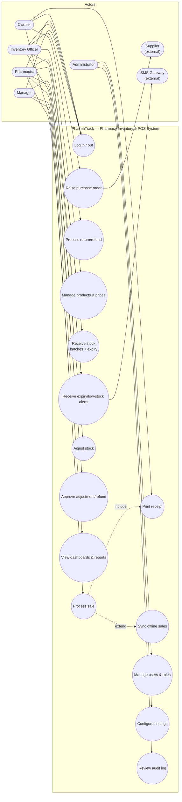
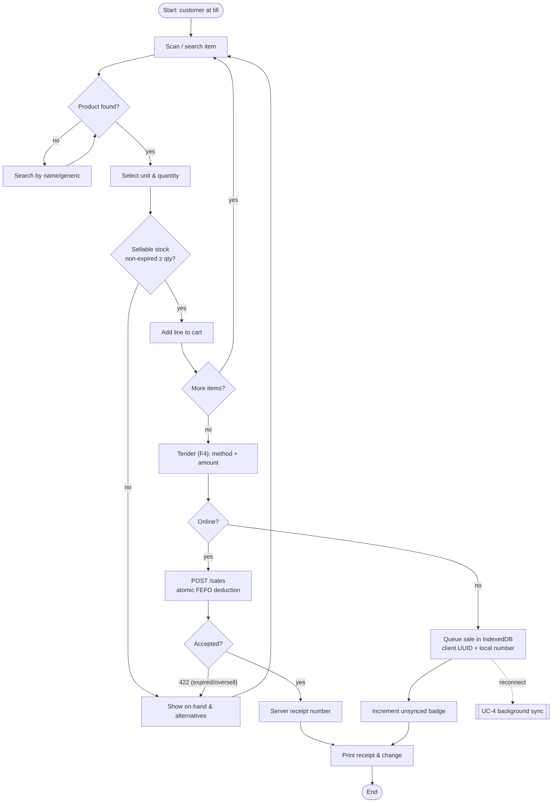
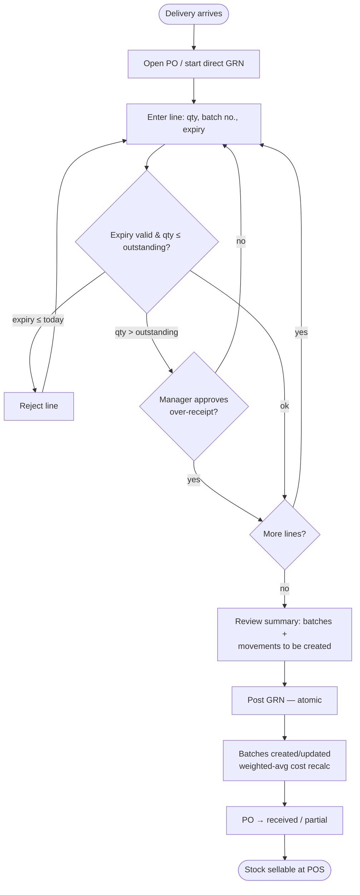
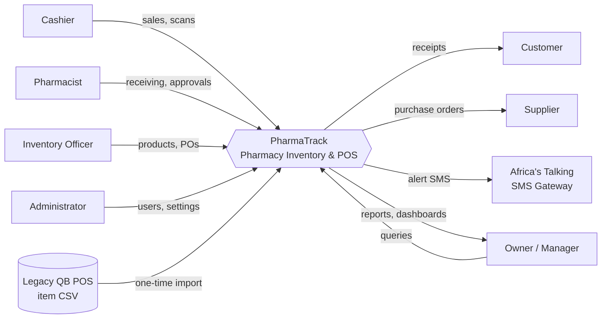
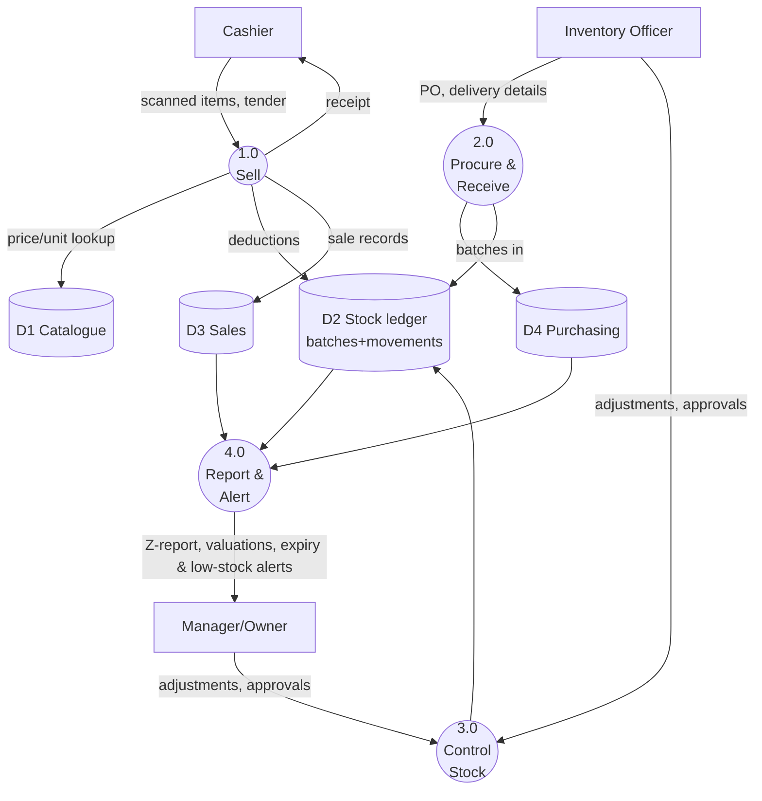
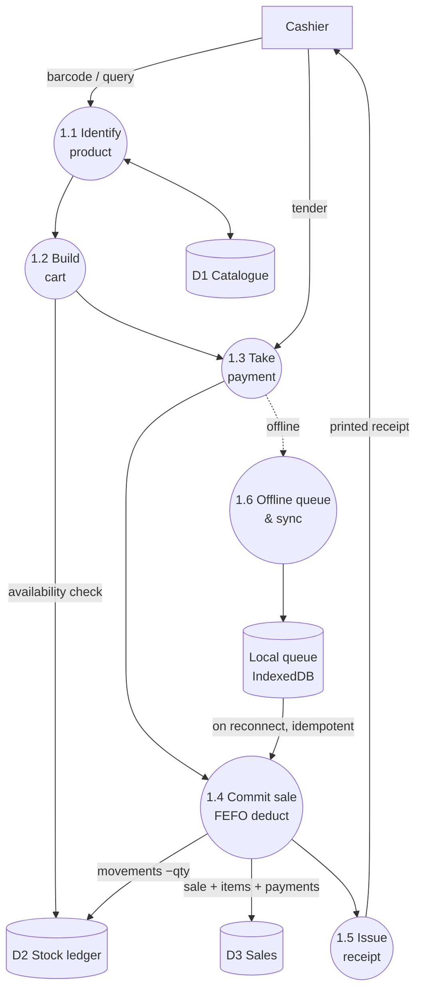
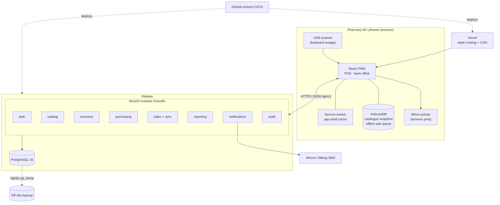
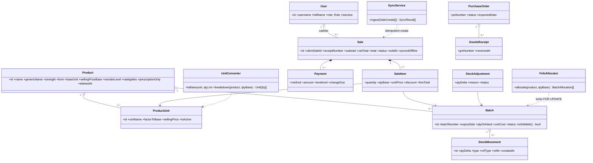
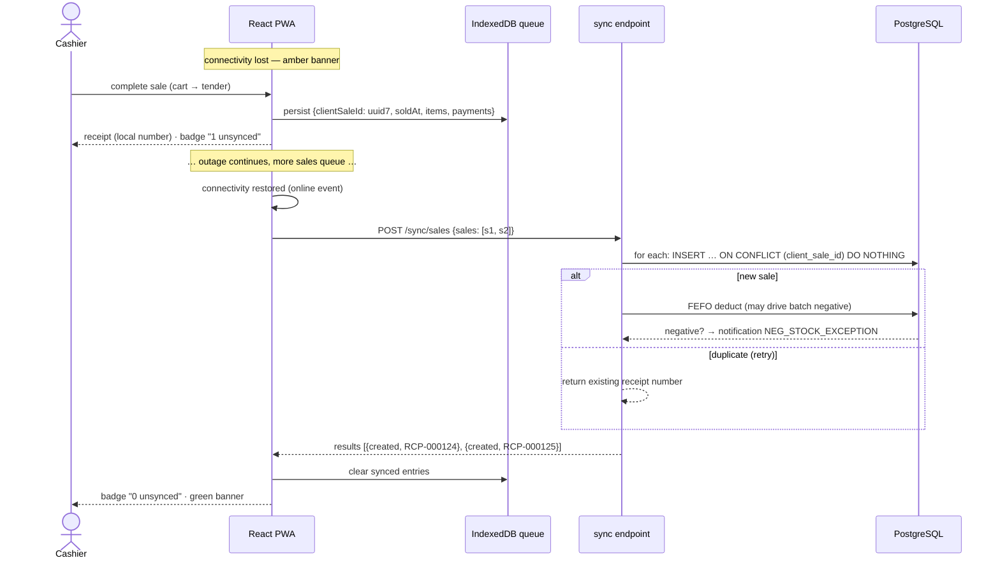
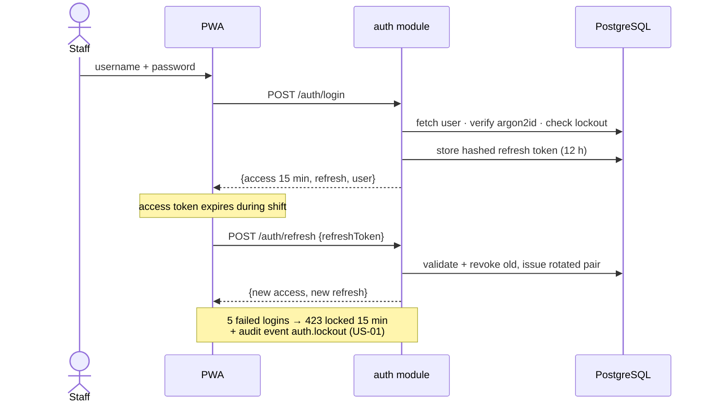

# Analysis & Design Models

**SRS supplements — use cases, activity, context/DFD, architecture, class & sequence
models.** All diagrams are Mermaid (GitHub renders natively). IDs cross-reference the
user stories (US-xx) in the Requirements Document.

---

## 1. Use case diagram



*Role inheritance: Manager can do everything a Pharmacist/Inventory Officer can; Admin
can do everything (permission matrix in ADR-005).*

## 2. Use case descriptions (5 primary)

### UC-2 Process sale (US-04/05/06/07/08)
| Field | Description |
|---|---|
| Actors | Cashier (primary), Customer (off-stage) |
| Preconditions | Cashier authenticated; catalogue cached locally |
| Main flow | 1. Cashier scans item (or searches by name/generic). 2. System adds line, showing unit options (carton/pack/strip/tablet) and FEFO batch availability. 3. Repeat for all items. 4. Cashier presses F4; enters tendered amount and method. 5. System validates stock atomically, records sale + movements, assigns receipt number. 6. Receipt prints; change displayed. |
| Alternate flows | A1 unknown barcode → search prompt. A2 offline → sale queued locally with client ID; receipt prints with local number; syncs on reconnect (UC-4). A3 insufficient stock → line blocked with on-hand shown. A4 expired batch only → sale blocked (BR-02). |
| Postconditions | Stock reduced by movements; immutable sale record; audit trail |

### UC-7 Receive stock (US-05/09)
| Field | Description |
|---|---|
| Actors | Inventory Officer (primary), Manager (over-receipt approval) |
| Preconditions | PO exists (or direct receipt allowed); supplier registered |
| Main flow | 1. Officer opens PO, enters per line: qty received, batch number, expiry date. 2. System validates (expiry > today; qty ≤ outstanding). 3. Officer posts. 4. System creates GRN, creates/tops up batches, writes RECEIPT movements, recalculates weighted-average cost, updates PO status. |
| Alternate flows | A1 over-receipt → Manager PIN required. A2 partial delivery → PO → PARTIALLY_RECEIVED. A3 short expiry (<90 d) → warning requiring confirmation. |
| Postconditions | Sellable stock available to POS with correct expiry ordering |

### UC-9 Adjust stock (US-12)
Actors: any stock role requests; Manager approves above threshold (BR-05). Main flow:
select product+batch → qty delta + reason + note → if |value| > threshold, status
PENDING_APPROVAL → Manager approves → ADJUSTMENT movement posts. Rejected adjustments
post nothing. All paths audited; shrinkage reportable by reason.

### UC-4 Sync offline sales (US-08)
Actor: system (background). Trigger: connectivity restored. Flow: queued sales POSTed in
order to `/sync/sales` → server creates each idempotently on `clientSaleId` → FEFO
deduction at sync time → response marks created/duplicate/error → till clears queue,
updates badge. Exception: batch oversold during outage → sale recorded, negative-stock
exception notification to Manager (ADR-006).

### UC-11 View reports (US-13)
Actor: Manager/Owner. Flow: pick report + date range → server reads reporting views →
render table + chart → optional CSV/PDF export. Z-report closes the trading day.

## 3. Activity diagram — Process sale (with offline branch)



## 4. Activity diagram — Receive purchase order



## 5. Context diagram (Level 0 system boundary)



## 6. Data flow diagram — Level 0



## 7. Data flow diagram — Level 1 of process 1.0 (Sell)



## 8. System architecture diagram



*Module diagram: see the dependency table in ADR-001; arrows inside `api` are enforced
by lint rules — `sales → catalog/inventory/customers`, `purchasing → suppliers/catalog/
inventory`, `audit` subscribes to events from all, `reporting` reads views only.*

## 9. Class diagram (domain layer, key types)



## 10. Sequence diagram — Online POS sale

```mermaid
sequenceDiagram
    actor C as Cashier
    participant W as React PWA
    participant A as sales module (API)
    participant I as inventory (FefoAllocator)
    participant DB as PostgreSQL

    C->>W: scan barcode
    W->>W: lookup in cached snapshot (instant)
    W-->>C: line added (price, stock, units)
    C->>W: F4 · tender cash 30.00
    W->>A: POST /sales {clientSaleId, items, payments}
    A->>DB: BEGIN
    A->>I: allocate(product, qtyBase)
    I->>DB: SELECT batches … FOR UPDATE (FEFO order)
    I-->>A: [batch allocations]
    A->>DB: INSERT sale, sale_items, payments,<br/>stock_movements; UPDATE batches
    A->>DB: COMMIT
    A-->>W: 201 {receiptNumber, change: 2.00}
    W-->>C: print receipt · show change
    Note over A,DB: audit interceptor logs sale.created
```

## 11. Sequence diagram — Offline sale & sync (ADR-006)



## 12. Sequence diagram — Login & token refresh (ADR-005)


