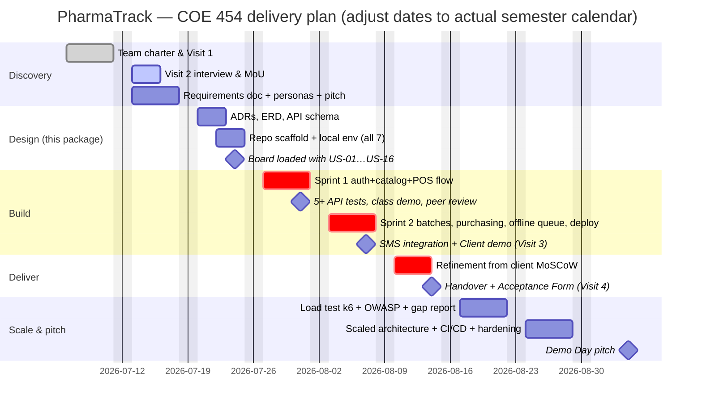

# Project Plan — Schedule, Roles, Risks, Milestones, Acceptance

**Owner:** Project Manager · Aligned to the COE 454 nine-week arc (brief §4–§5).

## 1. Schedule (Weeks 1–9)

## 2. Sprint scope mapping

| Sprint | Course requirement | Stories |
|---|---|---|
| Sprint 1 (Wk 4) | Auth + primary data model + one full workflow + 5 tests | US-01, US-02, US-03, US-04, US-06 (cash only), US-07 |
| Sprint 2 (Wk 5) | 3rd-party integration + live deploy + mobile 3G | US-05, US-09, US-10, US-11, US-13 (daily + low-stock + expiry), US-08 (offline queue), SMS alerts (Africa's Talking) |
| Wk 6 refinement | Client MoSCoW Must/Should items | US-12, US-14/15/16 as capacity allows + client feedback |

*The primary data model for Sprint 1 is **Product + ProductUnit** (the client's core
entity); batches land early in Sprint 2 so receiving can be demoed to the client.*

## 3. Team roles (course-mandated; fill names in the Team Charter)

| Role | Owns in this project |
|---|---|
| Project Manager | Board, standups, Gantt above, Visit scheduling, final pitch |
| Business Analyst | Requirements doc, visit logs/evidence, MoU, client sign-offs, feedback forms |
| UX / Design Lead | wireframes-ui-ux.md, Figma redraws, usability checks pre-demo, 3G/mobile verification |
| Backend Engineer ×2 | ADRs, schema.sql/Prisma, API modules, sync endpoint, deployment |
| Frontend Engineer | PWA, POS screen, offline queue, printing, dashboard |
| QA / Documentation Lead | Test plan + Jest/Supertest suites, README reproducibility, OWASP checklist (Wk 7), k6 load test, portfolio compilation |

## 4. Milestones & acceptance criteria

| # | Milestone | Acceptance criteria (evidence) |
|---|---|---|
| M1 | Wk 1 package submitted | Signed charter PDF; signed Visit 1 log + photo; discovery note; repo live |
| M2 | Requirements agreed | Doc ≥5 pages; ≥10 stories with ACs; MoU signed by client + lecturer; pitch delivered |
| M3 | Design complete | ≥5 ADRs; ERD ≥4 entities; API schema; board screenshot with all stories as issues; every member runs the scaffold locally |
| M4 | Sprint 1 demo | Live class demo: login → product CRUD → cash sale → receipt; test runner screenshot ≥5 passing |
| M5 | MVP live | Public URL works on a phone over 3G; client demo held; SMS alert screenshot; feedback form + MoSCoW backlog |
| M6 | Client acceptance | Signed MVP Acceptance Form; user guide ≤2 pages handed over; credentials transferred; retrospective note |
| M7–M9 | Scale & pitch | Gap analysis report; CI/CD green on main; k6 results; 10-min pitch with client on panel |

**MVP acceptance (product-level):** a cashier with 2 h training completes a scanned,
multi-unit cash sale with printed receipt in <90 s; stock decreases correctly by FEFO;
pulling the network cable does not stop selling and queued sales sync on reconnect; the
owner opens the dashboard on a phone and sees today's takings, low-stock and expiring
lists; the QB item list has been imported or a dated plan for it is agreed with the client.

## 5. Risk register

| # | Risk | L | I | Mitigation / owner |
|---|---|---|---|---|
| R1 | Client unavailable for Visit 2/3 scheduling | M | H | Book both visits at MoU signing; BA keeps a fallback contact; escalate to lecturer early (brief allows support) |
| R2 | Scope creep — "pharmacy software" is bottomless | H | H | MoSCoW frozen after Wk 2; Won't-have list in writing; PM guards sprint scope; new asks → Wk 6 backlog |
| R3 | Offline sync bugs corrupt stock | M | H | ADR-006 design (append-only, idempotent); sync endpoint has the densest test coverage; negative-stock exceptions surfaced, never hidden |
| R4 | QB CSV export impossible/dirty | M | M | Verify export at Visit 2 (Open Q9); fallback = top-200 products entered manually during training week |
| R5 | Only 1–2 members can actually code | M | H | Exemplar module pattern (ADR-003); pairing rota; non-coders own tests-as-specs, data entry, docs |
| R6 | Free-tier hosting sleeps/expires mid-demo | M | M | Render+Neon per ADR-009 (no expiring credit); keep-warm ping + pre-demo warm-up; offline-first POS masks cold starts; screen-recording backup mandated by brief §4.5.2 |
| R7 | Receipt printer incompatible with browser print | L | M | Print-to-PDF fallback proves the flow; kiosk silent-print flag; ESC/POS spike only if needed (ADR-008) |
| R8 | Team member non-delivery 2+ weeks | M | M | Charter §5 escalation; PM notifies lecturer in writing (required); peer-eval transparency |
| R9 | Client data mishandled (Act 843 / MoU §4) | L | H | Seed/demo data only in repos and AI tools; real data only in prod DB; deletion at semester end |
| R10 | Demo-day connectivity failure | M | M | Backup recording; offline mode is itself the star feature — rehearse the offline demo path |

## 6. GitHub board setup (Week 3 checklist)

- [ ] Project board: `Backlog / In Progress / In Review / Done`
- [ ] US-01…US-16 created as issues, each with its acceptance criteria as task list
- [ ] Labels: `sprint-1`, `sprint-2`, `wk6-refinement`, `module:*`, `bug`, `client-feedback`
- [ ] Branch protection on `main`: PRs only, 1 review required
- [ ] `.env.example` committed; `.env` gitignored; CI: lint + test on PR
- [ ] Screenshot the loaded board → Week 3 submission

## 7. Future improvements (post–Week 9 / Phase 2 pitch material)

1. **Multi-branch + stock transfer** — the schema's movement ledger extends with a
   `location_id`; the Multistore capability their QB edition nominally had.
2. **MTN MoMo / Paystack payment capture** at the till with automatic reconciliation.
3. **E-prescription capture** and prescriber records for controlled medicines (BR-08 full).
4. **Demand forecasting** for reorder suggestions (moving average → ML later — deliberately
   excluded from MVP per brief §3.2 guidance).
5. **NHIS/insurer billing** export.
6. **ESC/POS native printing + cash drawer kick.**
7. **Supplier portal / WhatsApp PO delivery** via WhatsApp Business API.
8. **Read-replica + job queue split** — the Week 8 scaling exercise turns module seams
   (ADR-001) into deployment seams: reporting on a replica, notifications on a worker.
