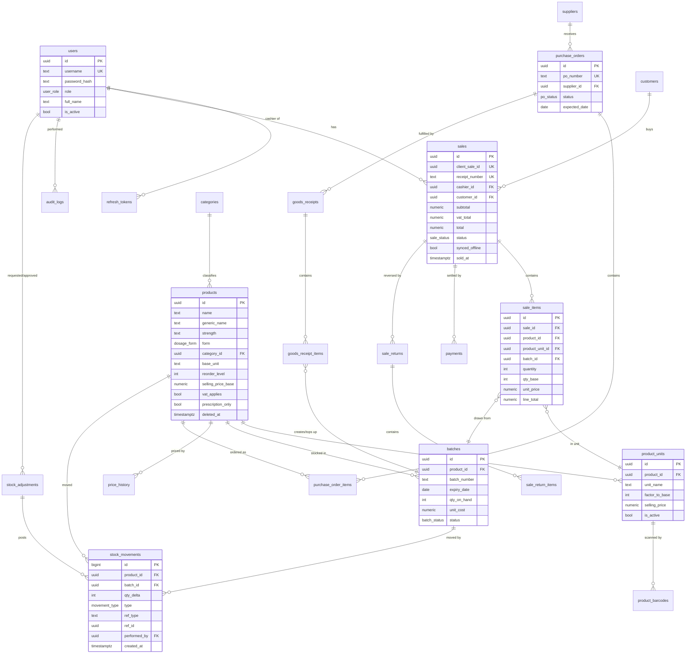

# Database Design — ERD & Data Dictionary Notes

**COE 454 — Week 3 Deliverable 2 (ERD, min 4 entities — this design has 20)**
**Owner:** Backend Lead · DDL in [schema.sql](schema.sql)

## Design rules applied everywhere

- **Audit fields:** every table carries `created_at`, `updated_at`; master data adds
  `created_by`/`updated_by` (FK → users).
- **Soft delete:** master data (`products`, `suppliers`, `customers`) uses `deleted_at`;
  people use `is_active`. Transactional records (sales, movements) are **immutable** —
  corrected by compensating records, never edited (BR-04).
- **Stock is a ledger.** `stock_movements` is append-only; a batch's quantity is the sum
  of its movements. `batches.qty_on_hand` is a denormalized running total maintained in
  the same transaction (guarded by `SELECT … FOR UPDATE`).
- **All quantities are integers in the product's base unit** (tablets, ml, pieces).
  Packs/strips/cartons convert through `product_units` at the edge, so stock math never
  sees fractions.
- **Money is `NUMERIC(12,2)` GHS.** Never floats.
- **Idempotent sync:** `sales.client_sale_id` (UUID, unique) makes offline replays safe
  (ADR-006).

## Entity-Relationship Diagram

*(Attribute lists abbreviated for readability; [schema.sql](schema.sql) is authoritative
and includes `payments`, `customers`, `suppliers`, `goods_receipts`, `stock_adjustments`,
`sale_returns`, `audit_logs`, `settings`, `price_history`, `refresh_tokens`.)*

## Normalization

The schema is in **third normal form (3NF)**:

- **1NF:** no repeating groups — multiple barcodes per product live in
  `product_barcodes` rows, not a comma-separated column; multiple pack sizes live in
  `product_units`.
- **2NF:** every non-key attribute depends on the whole key — e.g., `unit_price` sits on
  `sale_items` (depends on the sale line), not on `sales`.
- **3NF:** no transitive dependencies — supplier contact details live only in
  `suppliers`, never copied onto purchase orders; category name only in `categories`.

**Deliberate, documented denormalizations** (performance/immutability, each justified):

| Field | Why |
|---|---|
| `batches.qty_on_hand` | Hot-path read for POS and dashboards; recomputable from `stock_movements` (invariant checked by a nightly job). |
| `sale_items.unit_price`, `line_total`; `sales.total` | Point-in-time snapshot: receipts must not change when prices change later (BR-03/BR-04). |
| `stock_movements.qty_delta` sign convention | Positive = stock in, negative = stock out; avoids joins to interpret the ledger. |

## Keys, constraints & integrity highlights

| Concern | Mechanism |
|---|---|
| Primary keys | UUIDv7 app-generated (sortable, offline-safe); `stock_movements` uses `BIGINT IDENTITY` (append-only ledger) |
| No oversell (online) | Batch rows locked `FOR UPDATE` inside the sale transaction; `qty_on_hand` may go negative **only** via the offline-sync path, which flags an exception (ADR-006) |
| Expired stock unsellable | `batches.status` derived by nightly job + `CHECK (expiry_date > sold-at)` enforced in service layer; report view `v_expired_stock` |
| Valid money/quantities | `CHECK (quantity > 0)` on sale/PO/receipt lines; `CHECK (factor_to_base >= 1)`; `CHECK (total >= 0)` |
| Duplicate scans | `product_barcodes.barcode` globally unique |
| Idempotent offline sync | `sales.client_sale_id` unique |
| Referential integrity | FKs everywhere with `ON DELETE RESTRICT` (history is protected); soft delete instead of row deletion |

## Indexes (beyond PKs/UKs)

| Index | Serves |
|---|---|
| `GIN (name gin_trgm_ops)`, `GIN (generic_name gin_trgm_ops)` on `products` | <300 ms fuzzy search over 10k SKUs (NFR-01) |
| `batches (product_id, expiry_date) WHERE status = 'ACTIVE'` | FEFO pick + expiry dashboards |
| `stock_movements (product_id, created_at DESC)` | Product movement history |
| `stock_movements (ref_type, ref_id)` | Trace a sale/receipt to its ledger entries |
| `sales (sold_at DESC)`, `sales (cashier_id, sold_at)` | Z-reports, cashier reports |
| `sale_items (product_id, created_at)` | Top-sellers, product sales history |
| `audit_logs (entity, entity_id, created_at DESC)` | Entity audit trail |

## Reporting views

`v_stock_on_hand` (per product: base-unit qty, unit breakdown, valuation at cost),
`v_low_stock`, `v_expiring_batches` (30/60/90-day windows), `v_expired_stock`,
`v_daily_sales` (Z-report source), `v_shrinkage` (adjustments by reason). Defined in
schema.sql §7 — the `reporting` module reads only these views.
